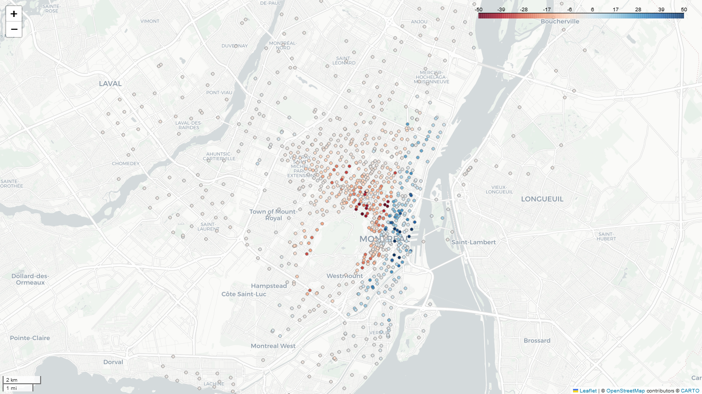

# Investigation into the balance of bikes at Bixi stations in Montreal 2023
People often complain that some stations have no bike available or that they cannot drop their bike because a station is already full. Some stations have a regular deficit or surplus of bike.

### Distribution of the mean daily bike balance

Most stations balance is around 0 with a mean is -0.13, but some stations have a large difference. 50% of the stations are between -4 and 2. But the minimum is -82 bikes maximum is 89 bikes which could support the impression the users have. Also, when a station is empty or full, the users need to go to another station nearby. Some solutions to ensure availability are : moving bikes around to balance the system, increase the number of bikes spaces at specific stations, or add more stations around those stations to provide nearby alternatives.

## Which stations are constantly out of bikes or out of space?
*The maps below show the mean number of bikes at the end of the day.*

### Mean Daily balance of bikes at stations

## Morning versus Afternoon comparison
Which stations are most used in the morning and in the afternoon.

### Morning

### Afternoon

Interactive maps can be explored by opening this **[notebook here](https://nbviewer.org/github/savardmaxime/Bixi-2023-stations-balance/blob/main/station_balance.ipynb)**

## The area around Mt. Royal is very active
### Could people prefer to ride bikes downhill?

The difference in altitude does not clearly affect pick-up and drop-off stations. The mean difference is -2m and 50% of the data is between -10m and 6m. 

**[Altitude analysis](https://github.com/savardmaxime/Bixi-2023-stations-balance/blob/main/altitude_analysis.ipynb)**

## Further investigation ideas
- Most universities are around the mountain, and students are often users of the bike sharing system. 
- What is the parking offer in the city, are people using bixi where there is no parking?

## Data sources
- Bixi data from https://bixi.com/fr/donnees-ouvertes/
- Altitude data from https://donnees.montreal.ca/dataset/modele-numerique-de-terrain-mnt

The solution is to move the bikes between those stations to satisfy the customers. 

But which stations constantly have not enough or too many bikes, and how many bikes should we have to move per day. Does the pattern change between mroning and afternoon?

In the maps below bikes need to be moved from blue stations to red stations, the darker the more bikes need to be repositioned.

Around university are affected. 